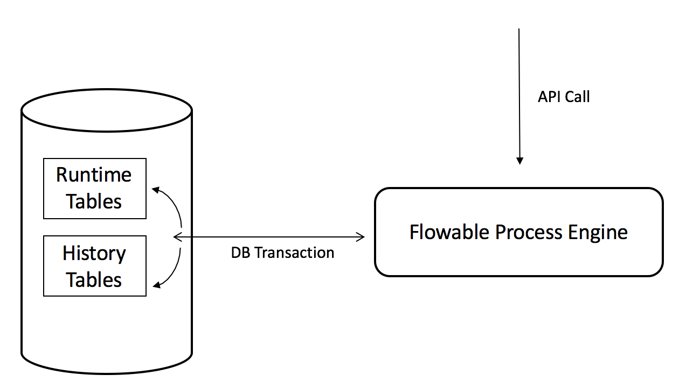
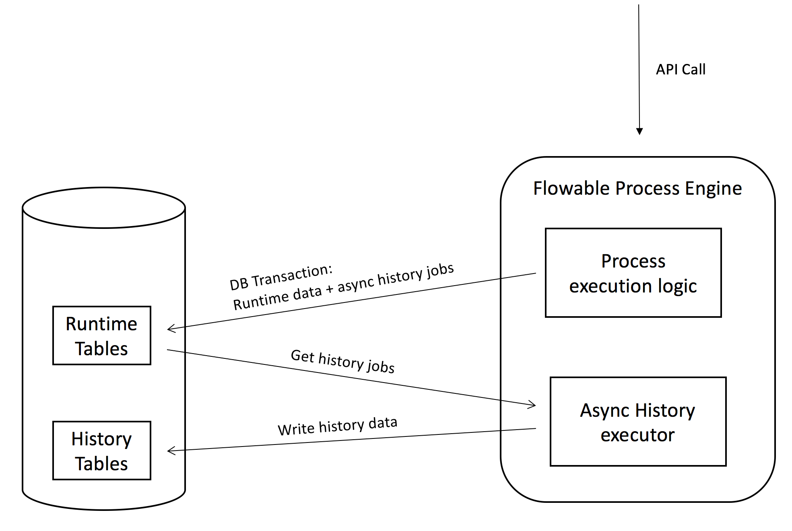
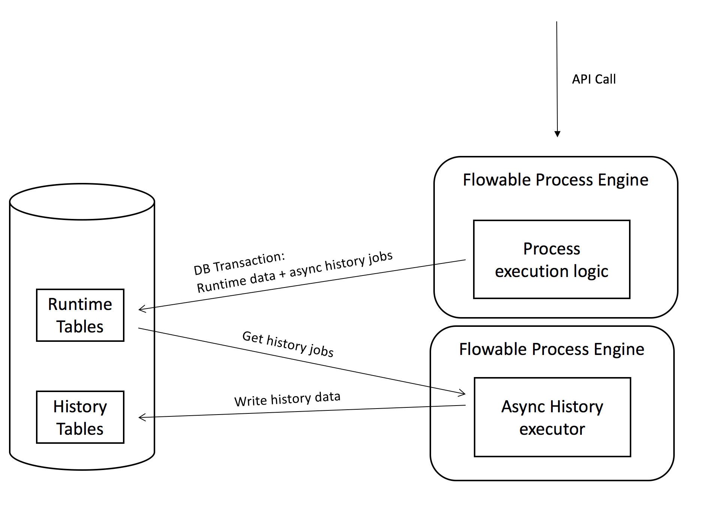

## Example: Flowable async history configuration

### Description

This example shows how to enable async history and to activate the default Async History Executor.

In the default setup (where Async History is disabled), history data is written to the history database tables in the same database transaction as the runtime data. 



When Async History is enabled, this history data is not written to the history tables, instead, a job is inserted that will be executed at a later time. This job is inserted in the same transaction as the runtime data, as this is crucial for correct audit data. If it wasn't written in the same database transaction, the runtime data could be rolled back due to some exception, but the history data could show that something else happened.

By default, a component using threadpools is used to process the Async History jobs called the 'Async History Executor'. This executor is nothing more than an instance of the regular Async Executor that's used for async jobs, timers, and so on, but configured to only pick up and handle Async History jobs.

These jobs contain all the data (stored as JSON) that normally would be written directly to the database in different rows over different history tables. With the default handler for these Async History jobs, it simply applies this data in the same way as for the synchronous history case: the only difference is that the data is processed later. This usually gives a slight performance boost, as inserting the jobs is faster than inserting into multiple history tables (but not much, unless having lots of automatic steps after each other). 

The figure below illustrates this approach. During the database transaction of the API call, the runtime data and the history jobs are inserted in the runtime tables. Later, and asynchronously, the Async History Executor polls the database, fetching these jobs and inserting the history data from those jobs to the history tables.



In this default setup, the Async History Executor polls the database for new work. This should be adequate for most use cases. See the more advanced examples that use a Message Queue to solve this. 

It's also possible to run the Async History Executor (similar to the Async Job Executor) on a different server (see diagram below). Currently, this means booting up a 'light' Process Engine that does nothing more than booting up the Async History Executor, but extracting these executors out to be a standalone component is planned.



Some customization can be made to the above setups by switching the default Async History job handler to an implementation that can use the historical data in many different ways. Use the _customHistoryJobHandlers_ property on the process engine configuration for this purpose.

### Dependencies

The only dependencies used here are the Flowable engine, Flowable-Spring (as the process engine from a Spring environment is going to be used), the H2 in-memory database and the Hikdari connection pooling framework:

```xml
<dependency>
	<groupId>org.flowable</groupId>
	<artifactId>flowable-engine</artifactId>
	<version>${flowable.version}</version>
</dependency>
<dependency>
	<groupId>org.flowable</groupId>
	<artifactId>flowable-spring</artifactId>
	<version>${flowable.version}</version>
</dependency>
		
<dependency>
	<groupId>com.h2database</groupId>
	<artifactId>h2</artifactId>
	<version>1.3.176</version>
</dependency>
		
<dependency>
	<groupId>com.zaxxer</groupId>
	<artifactId>HikariCP</artifactId>
	<version>2.6.3</version>
</dependency>
``` 

### Code 
 
First look at [the example process](src/main/resources/test-process.bpmn20.xml) that is going to be used here. It's a simple BPMN 2.0 process with a few user tasks that are assigned using process variables, mixed with some service tasks. Also, some parallel gateways to make it a bit more complex.
 
The process definition is deployed, started and its user tasks completed in the [src/main/java/org/flowable/Example](src/main/java/org/flowable/Example.java) class. The Process Engine is booted up from a Spring environment. Look at this if interested in that, but the main point about this example here is the configuration.
 
 The configuration is found in the [src/main/java/org/flowable/Configuration](src/main/java/org/flowable/Configuration.java) class.
 
 The following lines enable the async history:
 
 ```java
config.setAsyncHistoryEnabled(true);
config.setAsyncHistoryExecutorActivate(true);
```

The first line enables the Async History Executor, the second line activates it on boot (sometimes this isn't wanted immediately, such as for tests).
Now, history won't be written to the database history tables in the same transaction, but at a later time. Note that this means the history data will not be synchronized with the runtime state, as this is the default use case.

In the Configuration class, also three (optional) settings are used:

```java
config.setAsyncHistoryJsonGroupingEnabled(true);
config.setAsyncHistoryJsonGroupingThreshold(10);
config.setAsyncHistoryJsonGzipCompressionEnabled(false);
```

The first and second setting are related: if JSON grouping is enabled, one job will be created for all historical events with, of course, a larger JSON payload. By default it's one job for each event. The second setting defines the threshold for applying such grouping. Benchmarks have shown that the extra overhead of grouping only makes sense when having a larger number of historical actions in one transaction. In this example, one job is created when there are more than 10 async history jobs in the same transaction (which is also the default, if not set). Note that due to the granularity of some historical data, this happens quicker than might be thought.

The third setting enables gzip compression (using the JDK GZIPOutputStream) on the JSON stored with the Async History job. Benchmarks have shown this only makes sense when having grouping enabled, for two reasons. First, combining the JSON of different jobs adds lots of repetition in the same JSON data, which is perfect for applying compression, which is not the case for a single string of JSON for one historical action. Secondly, applying compression uses extra CPU resources, which only make sense if the actual compressed size of the JSON substantially reduces storage resources.