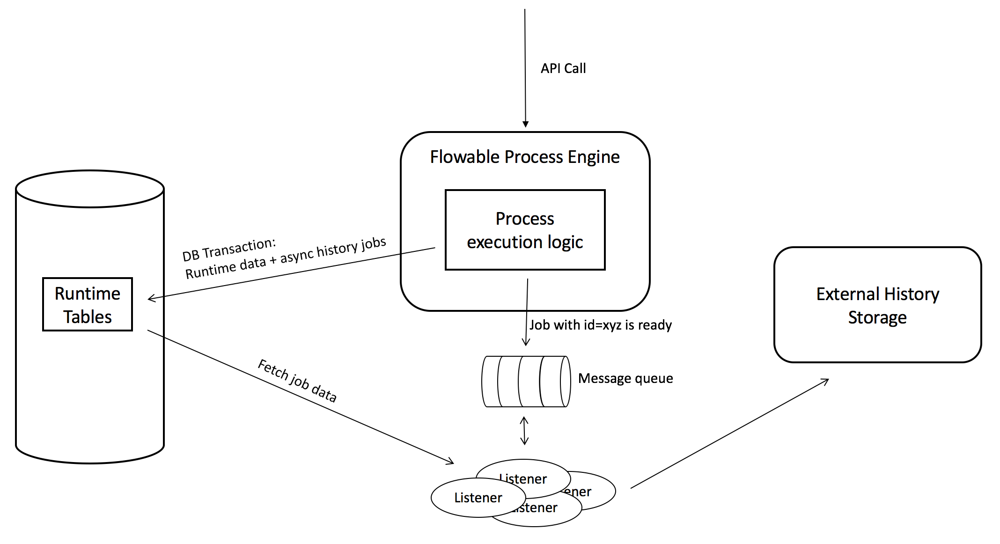

## Example: Flowable async history configuration using a JMS message queue

### Description

This example builds upon the knowledge gained from the [default async history configuration example](../async-history-default-cfg). 

In this example, the default async history setup that uses threadpools and database polling to do it's work is replaced by a message queue solution. In this particular example we'll use JMS as transport protocol, but any protocol works. Let's have a look at the various components of this setup:


* Instead of polling the database, a message is now send to a message queue that a historical job is ready.
* The history job data is inserted in the same transaction  as the runtime data. This is *very important* as we need to have transactional guarantees about the history data not being out of sync with the runtime data.
* Flowable provides an example message listener implementation which listen on the message queue for new messages,fetch the job data, process and store it in the historical tables.
* In case the data should not be stored in the history tables of Flowable, it's easy to use the same mechanism to store the data in an external data store (like MongoDb, Elasticsearch, another relational database, etc.)



Note that in this architecture, the message listeners do not have run on the same server as the process engine.

### Dependencies

As we're going to use JMS here, we'll need to add two dependencies to the previous example. See the [pom.xml](pom.xml) for all dependencies.


```xml
<dependency>
	<groupId>org.apache.activemq</groupId>
	<artifactId>activemq-broker</artifactId>
	<version>${activemq.version}</version>
</dependency>
<dependency>
	<groupId>org.flowable</groupId>
	<artifactId>flowable-jms-spring-executor</artifactId>
	<version>${flowable.version}</version>
</dependency>
``` 

We'll use ActiveMQ as the JMS broker in this example, which is the first dependency.

The second dependency includes the default JMS message listener implementations that write the data to the Flowable history tables. This dependency will transitively include the _spring-jms_ dependency. When not using the out of the box message listeners and using Spring, make sure to include the _spring-jms_ dependency instead when removing this dependency.


 ### Code 
 
 
The [example process](src/main/resources/test-process.bpmn20.xml) and [code to run it](src/main/java/org/flowable/Example.java) is exactly the same as in the default example. 
 
The configuration class is where the changes are and can be found at [src/main/java/org/flowable/Configuration](src/main/java/org/flowable/Configuration.java).
 
First, we'll set up the ActiveMQ connection factory:

```java
@Bean
public ConnectionFactory connectionFactory() {
	ActiveMQConnectionFactory activeMQConnectionFactory = new ActiveMQConnectionFactory("vm://localhost?broker.persistent=false");
	activeMQConnectionFactory.setUseAsyncSend(true);
	activeMQConnectionFactory.setAlwaysSessionAsync(true);
	activeMQConnectionFactory.setStatsEnabled(true);
	return new CachingConnectionFactory(activeMQConnectionFactory);
}
```   

Note that we're using an in-memory ActiveMQ broker here. To use a real and persistent ActiveMQ JMS broker, download and unzip the latest version from http://activemq.apache.org/. Run it using the script in the _bin_ folder (for example on Linux/OSX it is _./activemq console_) and switch the third line to

```java
ActiveMQConnectionFactory activeMQConnectionFactory = new ActiveMQConnectionFactory("tcp://127.0.0.1:61616");
```

The next step is configuring our message listener:

```java
@Bean
public MessageListenerContainer messageListenerContainer() {
	DefaultMessageListenerContainer messageListenerContainer = new DefaultMessageListenerContainer();
	messageListenerContainer.setConnectionFactory(connectionFactory());
	messageListenerContainer.setDestinationName("flowable-history-jobs");
	messageListenerContainer.setMessageListener(historyJobsMessageListener());
	messageListenerContainer.setConcurrentConsumers(10);
	messageListenerContainer.start();
	return messageListenerContainer;
}

@Bean
public HistoryJobMessageListener historyJobsMessageListener() {
	HistoryJobMessageListener historyJobMessageListener = new HistoryJobMessageListener();
	historyJobMessageListener.setProcessEngineConfiguration(processEngineConfiguration());
	return historyJobMessageListener;
}
```

In this example, we're running the message listeners in a simple _DefaultMessageListenerContainer_ from Spring, on the same machine and even same application context as the process engine. In practice, this could(/should) run on another machine. Here we're configuring 10 concurrent listeners to listen for new messages on the _floable-history-jobs_ queue.

The last bit to connect it all is configuring the process engine to send a message to the message queue when a new async history job is created:

```java
@Bean
public ProcessEngineConfigurationImpl processEngineConfiguration() {
	SpringProcessEngineConfiguration config = new SpringProcessEngineConfiguration();
	config.setDataSource(dataSource());
	config.setTransactionManager(transactionManager());
	config.setDatabaseSchemaUpdate(ProcessEngineConfiguration.DB_SCHEMA_UPDATE_DROP_CREATE);

	config.setAsyncHistoryEnabled(true);
	config.setAsyncHistoryExecutorActivate(true);
        
	config.setJobManager(jobManager());
	config.setAsyncHistoryExecutorMessageQueueMode(true);

	return config;
}

@Bean
public MessageBasedJobManager jobManager() {
	MessageBasedJobManager jobManager = new MessageBasedJobManager();
	jobManager.setHistoryJmsTemplate(jmsTemplate());
	return jobManager;
}

@Bean
public JmsTemplate jmsTemplate() {
	JmsTemplate jmsTemplate = new JmsTemplate();
	jmsTemplate.setDefaultDestination(new ActiveMQQueue("flowable-history-jobs"));
	jmsTemplate.setConnectionFactory(connectionFactory());
	return jmsTemplate;
}
```

The first obvious setting is enabling the async history:

```
config.setAsyncHistoryEnabled(true);
```

The main thing here is the custom _JobManager_ that's injected into the process engine configuration. This _MessageBasedJobManager_ takes care of sending the message to the message queue, in this case use the _JmsTemplate_ from Spring that's configured to send messages to the _flowable-history-jobs_ queue:

```
config.setJobManager(jobManager());
config.setAsyncHistoryExecutorMessageQueueMode(true);
```

One odd thing here maybe is the fact that the Async History Executor is activated and configured to run in 'message queue mode':

```
config.setAsyncHistoryEnabled(true);
config.setAsyncHistoryExecutorMessageQueueMode(true);
```

Don't worry, the async history executor will be booted in a _light_ mode: no polling is going on, the only thing is the 'reset of expired jobs' functionality. In case the message queue fails or is down, jobs would otherwise be in the system forever. This resetting makes sure job is sent to the message queue again later on.

In case you want to send the historical to another place than the Flowable history tables, use the code from above, but change the message listenern to another implementation.


