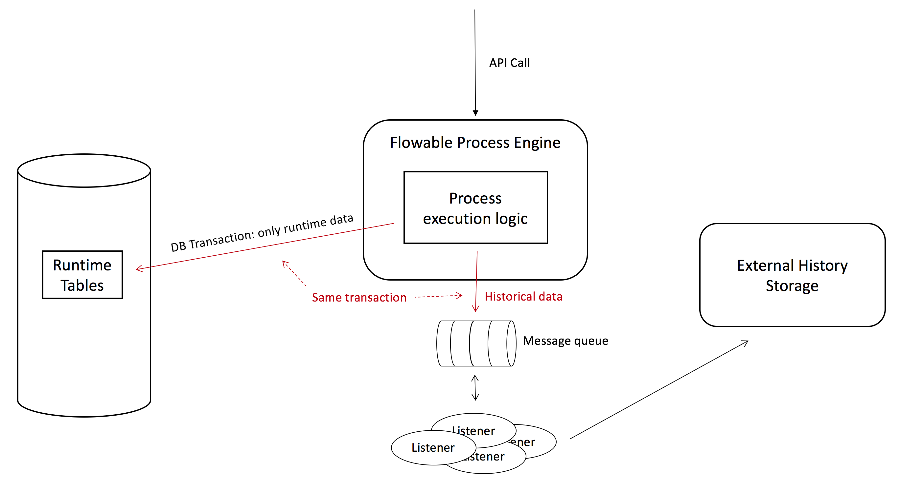

## Example: Flowable async history configuration using a JMS message queue with JTA

### Description

This example builds upon the knowledge gained from the [async history + JMS message queue configuration example](../flowable-async-history-jms-cfg). 

The setup of this example looks as follows:



The main difference with the previous example is that the historical data is now send to the message queue as a whole. In the non-JTA example, the job data was inserted and then a message was sent to the message queue with only the database id. The message listener would then fetch the data and process it.

Of course, when nothing is stored in the database, it is important that no data gets lost in the process (message queue crashed, network error, etc.) and as such we need to make storing the runtime data and sending the historical data part of the same transaction. The typical way to do this is using JTA.

In this example, we'll also demonstrate how to add a custom listener that does something else than storing the data in the FLowable historical database tables.


### Dependencies

As we're going to use JTA here, we'll need to add quite a few dependencies to the previous example with JMS. We've opted for the Atomikos (https://www.atomikos.com/) library as JTA provider. See the [pom.xml](pom.xml) for all dependencies.

```xml
<dependency>
	<groupId>javax.transaction</groupId>
	<artifactId>jta</artifactId>
	<version>1.1</version>
</dependency>
<dependency>
	<groupId>com.atomikos</groupId>
	<artifactId>transactions-api</artifactId>
	<version>4.0.4</version>
</dependency>
<dependency>
	<groupId>com.atomikos</groupId>
	<artifactId>transactions-jta</artifactId>
	<version>4.0.4</version>
</dependency>
<dependency>
	<groupId>com.atomikos</groupId>
	<artifactId>transactions-jdbc</artifactId>
	<version>4.0.4</version>
</dependency>
<dependency>
	<groupId>com.atomikos</groupId>
	<artifactId>transactions-jms</artifactId>
	<version>4.0.4</version>
</dependency>
``` 

### Code 
 
The [example process](src/main/resources/test-process.bpmn20.xml) and [code to run it](src/main/java/org/flowable/Example) is exactly the same as in the other async history examples. 
 
The configuration class is where the changes are and can be found at [src/main/java/org/flowable/Configuration](src/main/java/org/flowable/Configuration.java).
 
Setting up JTA is not trivial. First of all the datasource needs to be JTA-enabled. Note we're using MySQL now, instead H2:

```java
@Bean(initMethod = "init", destroyMethod = "close")
public DataSource dataSource() {
	MysqlXADataSource mysqlXaDataSource = new MysqlXADataSource();
	mysqlXaDataSource
		.setUrl("jdbc:mysql://localhost:3306/flowable?useSSL=false&characterEncoding=UTF-8&serverTimezone=UTC");
	mysqlXaDataSource.setPinGlobalTxToPhysicalConnection(true);
	mysqlXaDataSource.setPassword("flowable");
	mysqlXaDataSource.setUser("flowable");

	AtomikosDataSourceBean xaDataSource = new AtomikosDataSourceBean();
	xaDataSource.setXaDataSource(mysqlXaDataSource);
	xaDataSource.setUniqueResourceName("xads");
	xaDataSource.setBorrowConnectionTimeout(30000);
	xaDataSource.setMinPoolSize(10);
	xaDataSource.setPoolSize(20);
	xaDataSource.setMaxPoolSize(50);
	return xaDataSource;
}
``` 

Second, we need to set up a JTA transaction manager (this is well-documented in the Atomikos documentation):

```java
@Bean(initMethod = "init", destroyMethod = "shutdownForce")
public UserTransactionService userTransactionService() {
	Properties properties = new Properties();
	properties.put("com.atomikos.icatch.service", "com.atomikos.icatch.standalone.UserTransactionServiceFactory");
	UserTransactionServiceImp userTransactionServiceImp = new UserTransactionServiceImp(properties);
	return userTransactionServiceImp;
}

@Bean
public PlatformTransactionManager transactionManager() {
	JtaTransactionManager jtaTransactionManager = new JtaTransactionManager();
	jtaTransactionManager.setTransactionManager(atomikosTransactionManager());
	jtaTransactionManager.setUserTransaction(userTransaction());
	return jtaTransactionManager;
}

@Bean(initMethod = "init", destroyMethod = "close")
public UserTransactionManager atomikosTransactionManager() {
	UserTransactionManager userTransactionManager = new UserTransactionManager();
	userTransactionManager.setForceShutdown(false);
	userTransactionManager.setStartupTransactionService(false);
	return userTransactionManager;
}

@Bean
public UserTransaction userTransaction() {
	UserTransactionImp userTransactionImp = new UserTransactionImp();
	try {
		userTransactionImp.setTransactionTimeout(1000);
	} catch (SystemException e) {
		e.printStackTrace();
	}
	return userTransactionImp;
}
```

And lastly, the JMS connections also must partake in the JTA transactions:

```java
@Bean(initMethod = "init", destroyMethod = "close")
public ConnectionFactory connectionFactory() {
	ActiveMQXAConnectionFactory activeMQXAConnectionFactory = new ActiveMQXAConnectionFactory();
	activeMQXAConnectionFactory.setUseAsyncSend(true);
	activeMQXAConnectionFactory.setAlwaysSessionAsync(true);
	activeMQXAConnectionFactory.setStatsEnabled(true);
	activeMQXAConnectionFactory.setBrokerURL("tcp://127.0.0.1:61616");

	AtomikosConnectionFactoryBean atomikosConnectionFactoryBean = new AtomikosConnectionFactoryBean();
	atomikosConnectionFactoryBean.setUniqueResourceName("xamq");
	atomikosConnectionFactoryBean.setLocalTransactionMode(false);
	atomikosConnectionFactoryBean.setMaxPoolSize(100);
	atomikosConnectionFactoryBean.setBorrowConnectionTimeout(30000);
	atomikosConnectionFactoryBean.setXaConnectionFactory(activeMQXAConnectionFactory);
	return atomikosConnectionFactoryBean;
}
```    

Now we've got the datasource and the JMS message queue happily playing along using a JTA transaction.

The last bit to connecting it together is to set the _MessageBasedJobManager_ in the process engine configuration, like in the normal JMS example. We're also setting a custom _AsyncHistoryListener_:

```java
@Bean
public ProcessEngineConfigurationImpl processEngineConfiguration() {
	SpringProcessEngineConfiguration config = new SpringProcessEngineConfiguration();
	config.setDataSource(dataSource());
	config.setTransactionManager(transactionManager());
	config.setDatabaseSchemaUpdate(ProcessEngineConfiguration.DB_SCHEMA_UPDATE_DROP_CREATE);

	config.setAsyncHistoryEnabled(true);
	config.setAsyncHistoryExecutorActivate(true);
	config.setAsyncHistoryExecutorMessageQueueMode(true);

	config.setJobManager(jobManager());
	config.setAsyncHistoryListener(jmsAsyncHistoryListener());

	return config;
}

@Bean
public MessageBasedJobManager jobManager() {
	MessageBasedJobManager jobManager = new MessageBasedJobManager();
	jobManager.setHistoryJmsTemplate(jmsTemplate());
	return jobManager;
}

@Bean
public AsyncHistoryListener jmsAsyncHistoryListener() {
	JmsAsyncHistoryListener jmsAsyncHistoryListener = new JmsAsyncHistoryListener();
	jmsAsyncHistoryListener.setJmsTemplate(jmsTemplate());
	return jmsAsyncHistoryListener;
}
```

The custom _AsyncHistoryListener_ replaces the default implementation, which inserts a history job in the database table. Here, we don't need that, as we're using JTA and we're sure the data can't get lost. So the _JmsAsyncHIstoryListener_ will simply send the json to the message queue, serialized as JSON:

```java
public class JmsAsyncHistoryListener implements AsyncHistoryListener {
    
	protected JmsTemplate jmsTemplate;
    
    protected ObjectMapper objectMapper = new ObjectMapper();
    
    @Override
    public void historyDataGenerated(List<ObjectNode> historyObjectNodes) {
        try {
            final String msg = objectMapper.writeValueAsString(historyObjectNodes);
            jmsTemplate.send(new MessageCreator() {
                
                @Override
                public Message createMessage(Session session) throws JMSException {
                    return session.createTextMessage(msg);
                }
                
            });
        } catch (JsonProcessingException e) {
            e.printStackTrace();
        }
    }

    public JmsTemplate getJmsTemplate() {
        return jmsTemplate;
    }

    public void setJmsTemplate(JmsTemplate jmsTemplate) {
        this.jmsTemplate = jmsTemplate;
    }
    
}
```    

The message listener that will react to these messages looks as follows:

```java
public class ExampleJmsListener implements javax.jms.MessageListener {

    @Override
    public void onMessage(Message message) {
        if (message instanceof TextMessage) {
            TextMessage textMessage = (TextMessage) message;
            try {
                System.out.println("Received historical data : " + textMessage.getText());
            } catch (JMSException e) {
                e.printStackTrace();
            }
        }
    }

}

```

here we simply output the message that's received. However, in practice, the data can be stored in an external data store for any purpose necessary.

