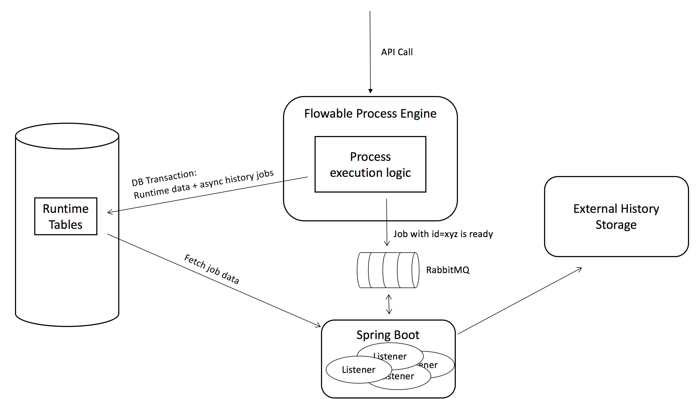

## Example: Flowable Async History configuration using RabbitMQ

### Description

This example contains the 'message listener' side of the story described in [the Async History with Rabbit MQ example](../async-history-rabbitmq-cfg). 

The setup described in that example looks as follows:



Using Spring Boot, message listeners are created that react on new history data being generated. The listener implementation, using the Flowable API, will then process the data and do something with it, like sending it to some external data store.


### Dependencies

The dependencies are pretty predictable:

* spring-boot-starter-amqp which transitively adds all Spring and AMQP dependencies
* The Flowable engine and Spring dependency, as we need to call the engine api in the message listener
* A database driver and connection pool framework

```xml
<dependencies>
	<dependency>
		<groupId>org.springframework.boot</groupId>
		<artifactId>spring-boot-starter-amqp</artifactId>
	</dependency>
	<dependency>
		<groupId>org.flowable</groupId>
		<artifactId>flowable-engine</artifactId>
		<version>${flowable.version}</version>
	</dependency>
	<dependency>
		<groupId>org.flowable</groupId>
		<artifactId>flowable-spring</artifactId>
		<version>${flowable.version}</version>
	</dependency>
	<dependency>
		<groupId>mysql</groupId>
		<artifactId>mysql-connector-java</artifactId>
	</dependency>
	<dependency>
		<groupId>com.zaxxer</groupId>
		<artifactId>HikariCP</artifactId>
	</dependency>
</dependencies>
``` 

### Code 
 
 The Spring Boot application (found in [src/main/java/org/flowable/Application.java](src/main/java/org/flowable/Application.java)) looks as follows:
 
 ```java
@SpringBootApplication
public class Application {
    
    private static final String queueName = "flowable-history-jobs";

    @Bean
    public Queue queue() {
        return new Queue(queueName, true);
    }
    
    @Bean
    public Binding binding() {
        return BindingBuilder.bind(queue()).to(exchange()).with(queueName);
    }
    
    @Bean
    public TopicExchange exchange() {
        return new TopicExchange("flowable-exchange");
    }
    
    @Bean
    public SimpleMessageListenerContainer container(ConnectionFactory connectionFactory, MessageListenerAdapter listenerAdapter) {
        SimpleMessageListenerContainer container = new SimpleMessageListenerContainer();
        container.setConnectionFactory(connectionFactory);
        container.setQueueNames(queueName);
        container.setMessageListener(listenerAdapter);
        container.setConcurrentConsumers(8);
        container.start();
        return container;
    }
    
    @Bean
    public Receiver receiver() {
        Receiver receiver = new Receiver();
        receiver.setAsyncHistoryJobMessageReceiver(asyncHistoryJobMessageReceiver());
        return receiver;
    }
    
    @Bean
    public MessageListenerAdapter listenerAdapter(Receiver receiver) {
        return new MessageListenerAdapter(receiver, "receiveMessage");
    }

    @Bean
    public AsyncHistoryJobMessageReceiver asyncHistoryJobMessageReceiver() {
        AsyncHistoryJobMessageReceiver asyncHistoryJobMessageListenerHelper = new AsyncHistoryJobMessageReceiver();
        asyncHistoryJobMessageListenerHelper.setProcessEngineConfiguration(processEngineConfiguration());
        asyncHistoryJobMessageListenerHelper.setAsyncHistoryJobMessageHandler(myJobMessageHandler());
        return asyncHistoryJobMessageListenerHelper;
    }
    
     @Bean
    public MyJobMessageHandler myJobMessageHandler() {
        return new MyJobMessageHandler();
    }
    
    @Bean
    public DataSource dataSource() {
        String jdbcUrl = "jdbc:mysql://localhost:3306/flowable?useSSL=false&characterEncoding=UTF-8&serverTimezone=UTC";
        String jdbcDriver = "com.mysql.jdbc.Driver";
        String jdbcUsername = "flowable";
        String jdbcPassword = "flowable";

        HikariDataSource dataSource = new HikariDataSource();
        dataSource.setJdbcUrl(jdbcUrl);
        dataSource.setDriverClassName(jdbcDriver);
        dataSource.setUsername(jdbcUsername);
        dataSource.setPassword(jdbcPassword);
        dataSource.setMaximumPoolSize(50);

        return dataSource;
    }

    @Bean
    public PlatformTransactionManager transactionManager() {
        DataSourceTransactionManager transactionManager = new DataSourceTransactionManager();
        transactionManager.setDataSource(dataSource());
        return transactionManager;
    }

    @Bean
    public ProcessEngineConfigurationImpl processEngineConfiguration() {
        SpringProcessEngineConfiguration config = new SpringProcessEngineConfiguration();
        config.setDataSource(dataSource());
        config.setTransactionManager(transactionManager());
        config.setDatabaseSchemaUpdate(ProcessEngineConfiguration.DB_SCHEMA_UPDATE_TRUE);
        return config;
    }

    @Bean
    public ProcessEngine processEngine() {
        return processEngineConfiguration().buildProcessEngine();
    }

    public static void main(String[] args) throws InterruptedException {
        SpringApplication.run(Application.class, args);
    }

}
```

The Queue, Binding, TopicExchange, SimpleMessageListenerContainer and Receiver bean are needed to set up a message listener for RabbitMQ. As messages are sent to an exchange in RabbitMQ (contrary to JMS where messages are sent to a queue): a _TopicExchange_ (where the engine will sent the messages to) is configured to route its messages to the _Queue_ instance using the _Binding_ definition.

The actual message listeners are instances of the _Receiver_ and run in the _SimpleMessageListenerContainer_ as defined above. Note that the _receiveMessage_ method is configured to receive the message in the _MessageListenerAdapter_ bean.

The _Receiver_ will simply pass the received message to the _AsyncHistoryJobMessageReceiver_ bean. This is a class part of the Flowable engine and contains the boilerplate logic to fetch the history job and parse its stored bytes to a JSON object:

```java
public class Receiver {
    
    private AsyncHistoryJobMessageReceiver asyncHistoryJobMessageReceiver;
    
    public void receiveMessage(byte[] messageBytes) {
        receiveMessage(new String(messageBytes));
    }

    public void receiveMessage(String message) {
        System.out.println("Received <" + message + ">");
        asyncHistoryJobMessageReceiver.messageForJobReceived(message);
    }

    public AsyncHistoryJobMessageReceiver getAsyncHistoryJobMessageReceiver() {
        return asyncHistoryJobMessageReceiver;
    }

    public void setAsyncHistoryJobMessageReceiver(AsyncHistoryJobMessageReceiver asyncHistoryJobMessageReceiver) {
        this.asyncHistoryJobMessageReceiver = asyncHistoryJobMessageReceiver;
    }

}
```

Note that the _AsyncHistoryJobMessageReceiver_ instance could be used directly in the _ListenerAdapter_, but for the sake of clarity that hasn't been done here.

To make this work, the _AsyncHistoryJobMessageReceiver_ needs to be able to access the Flowable API's. For this purpose, the _processEngineConfiguration_ and _dataSource_ are defined here, as the configuration needs to be injected in the receiver:

```java
@Bean
public AsyncHistoryJobMessageReceiver asyncHistoryJobMessageReceiver() {
	AsyncHistoryJobMessageReceiver asyncHistoryJobMessageReceiver = new AsyncHistoryJobMessageReceiver();
	asyncHistoryJobMessageReceiver.setProcessEngineConfiguration(processEngineConfiguration());
	asyncHistoryJobMessageReceiver.setAsyncHistoryJobMessageHandler(myJobMessageHandler());
	return asyncHistoryJobMessageReceiver;
}
```    

The last part of the puzzle is that the _AsyncHistoryJobMessageReceiver_ needs to know what to do with the history job data. For this purpose, as shown in the code snippet above, it needs an _AsyncHistoryJobMessageHandler_ instance. Here a dummy implementation (_MyJobMessageHandler_) is used to simply print out the data, but of course it is easy to imagine that such _JobMessageHandler_ does something more sophisticated with it.

When running this Spring Boot application, and executing the example from [the Async History with Rabbit MQ example](../async-history-rabbitmq-cfg), the output is now something like:

```
...
INFO 39467 --- [           main] org.flowable.Application                 : Started Application in 4.561 seconds (JVM running for 4.974)
Received <21>
Received <19>
Received <25>
Received <27>
Received <17>
Received <31>
Received <23>
Received <29>
Handling job 25, data = {"type":"task-assignee-changed","data":{"executionId":"14","activityId":"userTask01","__timeStamp":"2017-07-22T10:22:49.574Z","createTime":"2017-07-22T10:22:49.574Z","activityAssigneeHandled":"true","assignee":"assigneeOne","id":"15"}}
Handling job 23, data = {"type":"task-created","data":{"taskDefinitionKey":"userTask01","processDefinitionId":"testProcess:1:3","processInstanceId":"4","executionId":"14","activityId":"userTask01","__timeStamp":"2017-07-22T10:22:49.573Z","name":"User Task 01","tenantId":"","startTime":"2017-07-22T10:22:49.573Z","id":"15","priority":"50"}}
Handling job 27, data = {"type":"task-property-changed","data":{"taskDefinitionKey":"userTask01","processDefinitionId":"testProcess:1:3","__timeStamp":"2017-07-22T10:22:49.574Z","name":"User Task 01","id":"15","assignee":"assigneeOne","priority":"50"}}
Handling job 19, data = {"type":"activity-start","data":{"processDefinitionId":"testProcess:1:3","processInstanceId":"4","executionId":"14","activityId":"userTask01","__timeStamp":"2017-07-22T10:22:49.562Z","activityName":"User Task 01","tenantId":"","startTime":"2017-07-22T10:22:49.562Z","assignee":"assigneeOne","activityType":"userTask"}}
Handling job 29, data = {"type":"variable-created","data":{"processInstanceId":"4","executionId":"4","variableType":"null","__timeStamp":"2017-07-22T10:22:49.556Z","createTime":"2017-07-22T10:22:49.553Z","name":"initiator","id":"5","revision":"0"}}
Handling job 21, data = {"type":"activity-full","data":{"processDefinitionId":"testProcess:1:3","processInstanceId":"4","executionId":"14","activityId":"theStart","__timeStamp":"2017-07-22T10:22:49.561Z","activityName":"Start","tenantId":"","startTime":"2017-07-22T10:22:49.559Z","endTime":"2017-07-22T10:22:49.561Z","activityType":"startEvent"}}
Handling job 17, data = {"type":"process-instance-start","data":{"processInstanceId":"4","processDefinitionId":"testProcess:1:3","startActivityId":"theStart","__timeStamp":"2017-07-22T10:22:49.557Z","tenantId":"","startTime":"2017-07-22T10:22:49.553Z","id":"4","processDefinitionVersion":"1","processDefinitionKey":"testProcess"}}
Handling job 31, data = {"type":"variable-created","data":{"processInstanceId":"4","executionId":"4","variableType":"string","__timeStamp":"2017-07-22T10:22:49.557Z","variableTextValue":"assigneeEight","createTime":"2017-07-22T10:22:49.557Z","name":"assignee08","id":"6","revision":"0"}}
Received <35>
...
```
    


