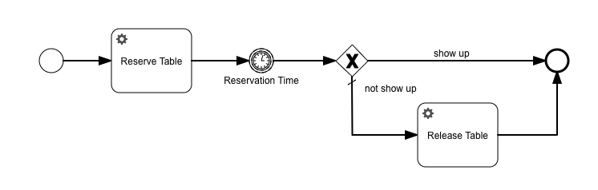
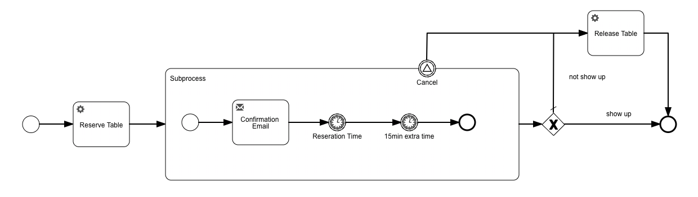

### Migration of a BPMN process

In this Spring Boot (v2.1.6.RELEASE) project we migrate a Flowable BPMN process with Flowable OSS (v6.4.1). The use case is a simple restaurant reservation process.

old process model:

new process model:

